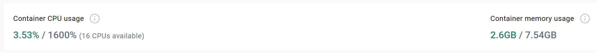

# Projetos Java

> [!NOTE]
> A proposta deste repositório é fornecer com base na framework do Spring Boot exemplos práticos:

1. **Mensageria com Rabbit MQ**

    Sistemas de comunicação assíncrona entre sistemas distribuidos utilizando o protocole AMQP.

2. **Mensageria com Kafka**

    Sistemas de comunicação assíncrona entre sistemas distribuidos, utilizando tópicos (topics) e divididos em partições (partitions) .

3. **Spring Security LDAP**

    Framework de autenticação e autorização via LDAP ( Apache OpenLdap ) e Bcrypt (Mysql).

4. **Visualização**

    Engine Thymeleaf para desenvolvimento web baseado em XML, XHTML e HTML5..

5. **Arquitetura Micro-Serviços**

    Arquitetura em micro-serviços com a integração entre APIs com o uso de JWT (JSON Web Tokens).

> [!IMPORTANT]
> Necessário ter instalado na máquina as ferramentas.

- Docker v25.0.xxx
- Docker Compose v2.24.xxx
- Git v1.8.x.x
- Postman
- S.O. Windows 10 Pro (19045.4046) ou Ubuntu 18.04 LTS (Bionic Beaver)

> [!IMPORTANT]
> Para iniciar todos os projetos, é recomendável que o computador tenha pelo menos **3GB de memória disponível**.




## Iniciar

Para baixar as imagens do Docker, é necessário primeiro clonar o repositório e autenticar-se no GitHub Container Registry (GHCR) do GitHub.

1. Clonar Projeto

```sh
$ git clone https://github.com/ramiralvesmelo/spring-boot-images.git
$ cd spring-boot-images
```

2. Autenticar GHCR

> [!IMPORTANT]
> A chave de acesso dever ser solicitada ao administrador da conta.

```sh
$ docker login ghcr.io -u ramiralvesmelo 
```

## Importar Collection 

Importar as collections para o Postman.

- <a href="spring-boot-kafka/spring-boot-kafka.postman_collection.json">spring-boot-kafka.json</a>
- <a href="spring-microservico/spring-microservico.postman_collection.json">spring-microservico.json</a>
- <a href="spring-boot-rabbitmq/spring-boot-rabbitmq.postman_collection.json">spring-boot-rabbitmq.json</a>

## Acessos

> [!CAUTION]
> Para que não haja conflitos de porta, segue abaixo relação de todas utilizadas nos projetos.

### Sprin Security + Thymeleaf + OpenLDAP

- http://127.0.0.1:8081/

| Aplicação     | Porta         | Descrição                 |
| :------------ |:-------------:| :----------------------   |
| App-Web       | 8081          | Aplicação de front-end.   |
| Open LDAP     | 10389, 10636  | Servidor LDAP.            |


### Kafka

- http://127.0.0.1:8081/
- http://127.0.0.1:8080/
- <a href="spring-boot-kafka/spring-boot-kafka.postman_collection.json">spring-boot-kafka.json</a>

| Aplicação         | Porta         | Descrição                                |
| :-----------------|:-------------:| :----------------------                  |
| Apache ZooKeeper  | 22181         | Centralizador de chamados.               |
| Apache Kafka-MB   | 9092, 9099    | Servidor Message Broker.                 |
| kafka-ui          | 8084          | Interface de monitoração.                |
| kafka-producer    | 8085          | Aplicação que envia mensagens ao broker. |
| kafka-cosumer     | 8086          | Aplicação que recebe mensagens ao broker.|

### Rabbit MQ UI

 - http://127.0.0.1:8083/
 - http://127.0.0.1:15672/	
 - <a href="spring-boot-rabbitmq/spring-boot-rabbitmq.postman_collection.json">spring-boot-rabbitmq.json</a>

| Aplicação         | Porta         | Descrição                                |
| :-----------------|:-------------:| :----------------------                  |
| Rabbit MQ         | 5672, 15672   | Servidor Message Broker.                 |
| rabbitmq-consumer | 8082          | Aplicação que envia mensagens ao broker. |
| rabbitmq-producer | 8083          | Aplicação que recebe mensagens ao broker.|

### Micro-Serviço

 - http://127.0.0.1:8087/
 - http://127.0.0.1:8088/
 - http://127.0.0.1:3306/
 - <a href="spring-microservico/spring-microservico.postman_collection.json">spring-microservico.json</a>
 
| Aplicação         | Porta         | Descrição                         |
| :-----------------|:-------------:| :----------------------           |
| api.auth          | 8087          | API de autenticação               |
| api.usuar         | 8088          | API de acesso a entidade Usuário  |
| MySQL             | 3306          | Banco de dados Relacional.        | 

## Iniciar Docker-Compose

Para iniciar as imagens, é necessário estar no diretório raiz do projeto e executar os comandos informados.

```sh
# Iniciar projeto Micro-Serviços
$ docker compose -f ./microservico/docker-compose.yml up

# Iniciar projeto Kafka
$ docker compose -f ./kafka/docker-compose.yml up

# Iniciar projeto Rabbit MQ
$ docker compose -f ./rabbitmq/docker-compose.yml up

# Iniciar projeto OpenLdap
$ docker compose -f ./openldap/docker-compose.yml up

```

## Limpar Ambiente

Caso queira você pode remover as imagens e credencial da máquina executando os comandos.

> [!CAUTION]
> Os comando irão remover **TODAS** as credências do GitHub e imagens existentes na sua máquina.

```sh
$ git config --global --unset credential.helper
$ docker system prune --all --force --volumes
```